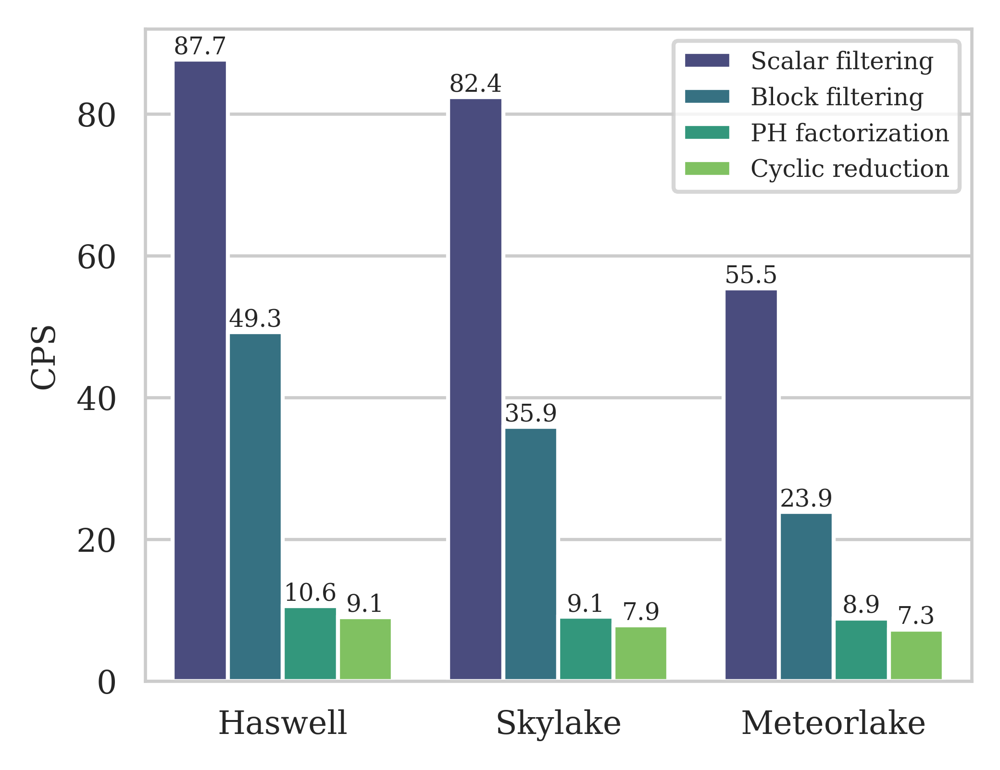

# SIMD-Parallel IIR Filter Library for Cascaded Biquads

A high-performance C++ header-only library for parallel IIR (recursive) filtering of cascaded second-order sections (biquads) using SIMD vector instructions.

This library accompanies the paper:

> **H. Zhai and B.-P. Paris**, "Fast Cascaded Recursive Filtering via a Block-Matrix Reformulation," submitted to *IEEE Transactions on Signal Processing*, 2026. [[arXiv]](https://arxiv.org/)

## Overview

Recursive (IIR) filters realized as cascaded biquads offer both design generality and robustness against coefficient quantization, but their sample-to-sample feedback dependency poses a fundamental obstacle to parallel computation. This library reformulates the biquad difference equation as a banded block-Toeplitz linear system and introduces a stride-*N* permutation that maps groups of *NL* samples into a block-tridiagonal structure amenable to parallel solution.

Two parallel algorithms are provided for the recursive stage:

- **PH factorization** — a partial LU decomposition that preserves the sparse block structure and solves the terminal blocks via Sklansky recursive doubling.
- **Cyclic reduction** — reduces the sequential dependency depth from O(*N*) to O(log₂ *N*) by systematically eliminating alternating blocks at each level.

For a cascade of *K* biquads, the intermediate permutations between successive sections cancel exactly, so only a single permutation/de-permutation pair is required for the entire cascade — eliminating 2(*K*−1) redundant stages.

## Performance

All algorithms are validated against cycle-accurate measurements on three Intel micro-architectures spanning multiple generations: **Haswell**, **Skylake**, and **Meteor Lake** (P-cores), all using AVX2 SIMD instructions.

For a 16th-order cascaded IIR filter, the best clock cycles per sample (CPS) achieved by each algorithm on each architecture:

<div align="center">
  
</div>

On a single Meteor Lake core at 4.5 GHz, cyclic reduction achieves the lowest CPS of 7.3, yielding a throughput of approximately **618 MS/s** — an **8× speedup** over `scipy.signal.sosfilt` and up to **12× reduction** in clock cycles per sample compared to scalar filtering.

## Repository Structure

```
├── include/                 # Header-only library (all algorithms)
│   ├── filter.h             # Top-level cascaded filter interface
│   ├── series.h             # Variadic biquad cascade via std::tuple
│   ├── iir_cores.h          # Second-order IIR section (scalar/block/multi-block)
│   ├── fir_cores.h          # Non-recursive (FIR) stage
│   ├── block_filtering.h    # Single-block filtering algorithm
│   ├── cyclic_reduction.h   # Cyclic reduction solver
│   ├── ph_decompos.h        # PH factorization (particular/homogeneous)
│   ├── recursive_doubling.h # Sklansky recursive doubling for terminal blocks
│   ├── permute.h            # Stride-N block permutation / de-permutation
│   └── shift_reg.h          # Delay-line shift register
├── src/
│   ├── vcl/                 # Agner Fog's Vector Class Library (see setup below)
│   └── doctest.h            # doctest unit testing framework (included)
├── test/                    # Correctness tests (doctest-based)
│   ├── test.sh              # Run all tests
│   ├── filter.cpp           # End-to-end cascaded filter tests
│   ├── iir_cores.cpp        # IIR core algorithm tests
│   ├── fir_cores.cpp        # Non-recursive stage tests
│   ├── cyclic_reduction.cpp # Cyclic reduction tests
│   ├── ph_decompos.cpp      # PH factorization tests
│   ├── block_filtering.cpp  # Block filtering tests
│   └── permute.cpp          # Permutation tests
├── measurement/             # Performance measurement tools
│   ├── PMCTestB.cpp         # PMCTest benchmark harness
│   ├── c64.sh               # PMCTest quick-run script
│   ├── pmc_measure.sh       # Full statistical measurement pipeline
│   ├── run_filter.cpp       # End-to-end filter benchmark
│   ├── run_filter.sh        # Compile and run the filter benchmark
│   ├── data_analyze.py      # Outlier filtering and statistical analysis
│   ├── histogram.ipynb      # Measurement distribution analysis
│   ├── measurement.ipynb    # Measurement data processing
│   └── *.ods                # Raw measurement tables (Haswell/Skylake/Meteor Lake)
├── notebook/                # Theory and paper figures
│   ├── IIR_theory.ipynb     # Mathematical derivations with Python reference code
│   └── IIR_plot1-4.ipynb    # Paper figure generation
└── plot/                    # Generated figures
```

## Dependencies

- **C++20** compiler with AVX2/FMA support (Clang 18+ recommended; GCC with C++20 and AVX2 support also works)
- **Agner Fog's Vector Class Library (VCL)** — portable SIMD intrinsics
- **doctest** — header-only unit testing (included in `src/`)

### Setting Up VCL

The `src/vcl/` directory is intentionally empty. You must download VCL from [Agner Fog's GitHub](https://github.com/vectorclass/version2) and place it there:

```bash
cd src/
git clone https://github.com/vectorclass/version2.git vcl
```

## Building and Running Tests

Run all correctness tests:

```bash
cd test/
chmod +x test.sh
./test.sh
```

The script auto-detects `clang++` or `g++`, compiles and runs each doctest file, and prints a summary:

```
========================================
  Running 7 correctness tests
========================================

block_filtering         PASSED
fir_cores               PASSED
permute                 PASSED
ph_decompos             PASSED
cyclic_reduction        PASSED
iir_cores               PASSED
filter                  PASSED

========================================
  Results: 7 passed, 0 failed, 0 compile errors (of 7)
========================================
```

Or compile a single test manually:

```bash
clang++ -std=c++20 -mavx2 -mfma -march=native -O2 -ffast-math \
    test/filter.cpp -o filter_test
./filter_test
```

## Performance Measurement

### System Setup

Before running any benchmarks, set the CPU governor to performance mode to prevent frequency scaling from affecting measurements:

```bash
echo performance | sudo tee /sys/devices/system/cpu/cpu*/cpufreq/scaling_governor
```

### End-to-End Filter Benchmark

The `run_filter` benchmark measures clock cycles per sample for the complete cascaded filter using wall-clock, TSC, and core cycle counters, then compares against PMCTest reference values:

```bash
cd measurement/
chmod +x run_filter.sh

# Default: 16th-order CR on Haswell reference, N=8
./run_filter.sh

# Specify algorithm, order, block size, and architecture reference
./run_filter.sh --algo cr --order 16 --blocksize 32 --arch meteorlake
./run_filter.sh --algo ph --order 8 --blocksize 16 --arch skylake
./run_filter.sh --algo scalar --order 4 --arch haswell
./run_filter.sh --algo bf --order 16
```

### Per-Stage Measurement with PMCTest

For detailed per-stage hardware counter measurements (clock cycles, µops, cache misses, resource stalls), the library uses [Agner Fog's PMCTest](https://www.agner.org/optimize/) framework.

**Setup:**

1. Download `testp` from [agner.org/optimize](https://www.agner.org/optimize/) and extract it to `~/testp/`.
2. Build and load the MSRdrv kernel driver:
   ```bash
   cd ~/testp/DriverSrcLinux
   make
   sudo sh install.sh
   ```
   Note: the driver must be reloaded after every reboot.
3. Place `measurement/PMCTestB.cpp` and `measurement/c64.sh` into `~/testp/PMCTest/`, replacing the defaults that came with testp. The measurement script `pmc_measure.sh` will then modify `PMCTestB.cpp` in place via `sed` to configure each benchmark run (setting the vector type, block size, and test function automatically).

**Running measurements:**

```bash
cd measurement/
chmod +x pmc_measure.sh

# Measure individual stages
./pmc_measure.sh 1000 Vec8f permute        # permutation stage
./pmc_measure.sh 1000 Vec8f F              # FIR (non-recursive) stage
./pmc_measure.sh 1000 Vec8f PS             # particular solution
./pmc_measure.sh 1000 Vec8f HS             # homogeneous solution
./pmc_measure.sh 1000 Vec8f CR             # cyclic reduction

# Measure complete filter (order 16, N=8)
./pmc_measure.sh 1000 Vec8f 8 Filter 128 8
```

Each run executes the benchmark 1000 times, filters outliers using σ-based analysis, and saves results to `filtered_means.txt`.

## Algorithms at a Glance

| Algorithm | Block FMAs/sample | Sequential depth | Best regime |
|-----------|:-:|:-:|---|
| Scalar filtering | 4 | 1 per sample | — |
| Block filtering | 1 + 4/*L* | log₂*L* / *L* | Baseline SIMD |
| PH factorization | 6/*L* + O(1/*NL*) | 1/*L* + O(log₂*L* / *NL*) | Small sample sizes |
| Cyclic reduction | 6/*L* + O(1/*N*) | O(log₂*N* / *NL*) | Large sample sizes |

Where *L* = SIMD vector width and *N* = number of blocks per signal block group.

## Supported Platforms

The library targets x86-64 CPUs with SIMD extensions. It has been tested on:

| Micro-architecture | SIMD | Clock | Notes |
|---|---|---|---|
| Intel Haswell | AVX2 + FMA | 3.3 GHz | Earliest AVX2 generation |
| Intel Skylake | AVX2 + FMA | 4.0 GHz | Improved FMA throughput |
| Intel Meteor Lake | AVX2 + FMA | 4.5 GHz | Hybrid P-core / E-core (P-cores used) |

SSE (`Vec4f`, *L*=4), AVX2 (`Vec8f`, *L*=8), and AVX-512 (`Vec16f`, *L*=16) are supported through compile-time template specialization.

## Notebooks

The theory and measurement notebooks use LaTeX features that GitHub cannot render. View them with full formatting on nbviewer:

- [IIR_theory.ipynb](https://nbviewer.org/github/Haotian-RA/matrix_form_recursive_filtering/blob/master/notebook/IIR_theory.ipynb) — Mathematical derivations with Python reference implementations
- [IIR_plot1.ipynb](https://nbviewer.org/github/Haotian-RA/matrix_form_recursive_filtering/blob/master/notebook/IIR_plot1.ipynb) — Per-stage measurement plots
- [IIR_plot2.ipynb](https://nbviewer.org/github/Haotian-RA/matrix_form_recursive_filtering/blob/master/notebook/IIR_plot2.ipynb) — Normalized CPS across orders and architectures
- [IIR_plot3.ipynb](https://nbviewer.org/github/Haotian-RA/matrix_form_recursive_filtering/blob/master/notebook/IIR_plot3.ipynb) — Additional analysis plots
- [IIR_plot4.ipynb](https://nbviewer.org/github/Haotian-RA/matrix_form_recursive_filtering/blob/master/notebook/IIR_plot4.ipynb) — Algorithm comparison (Figure 8)

## Citation

If you use this library in your research, please cite:

```bibtex
@article{zhai2026fast,
  author  = {Zhai, Haotian and Paris, Bernd-Peter},
  title   = {Fast Cascaded Recursive Filtering via a Block-Matrix Reformulation},
  journal = {arXiv preprint},
  year    = {2026}
}
```

The citation will be updated once the paper is published.

## License

This project is licensed under the MIT License — see [LICENSE](LICENSE) for details.
